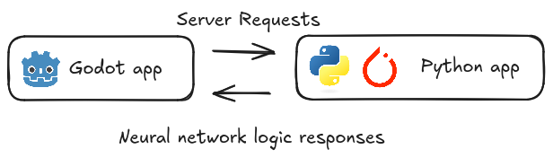
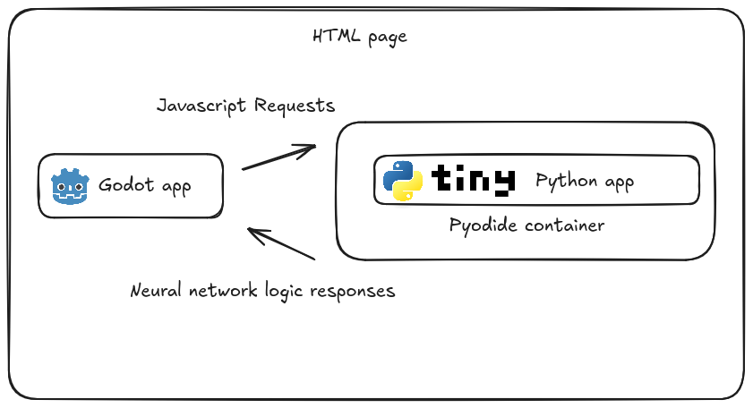
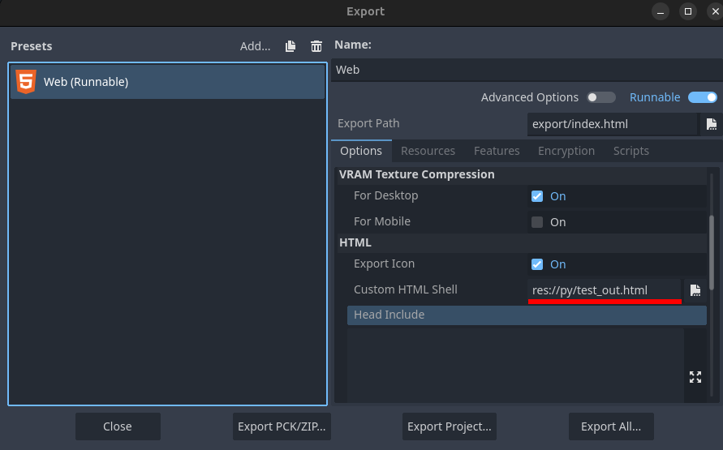
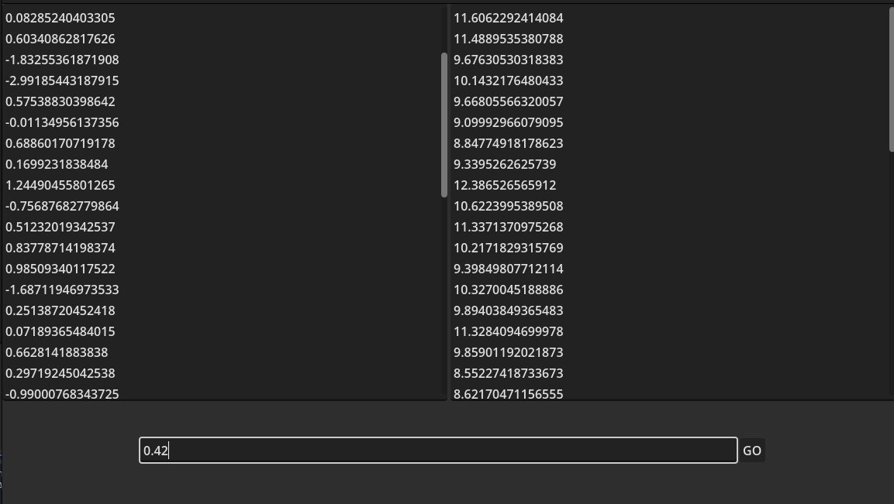
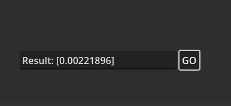
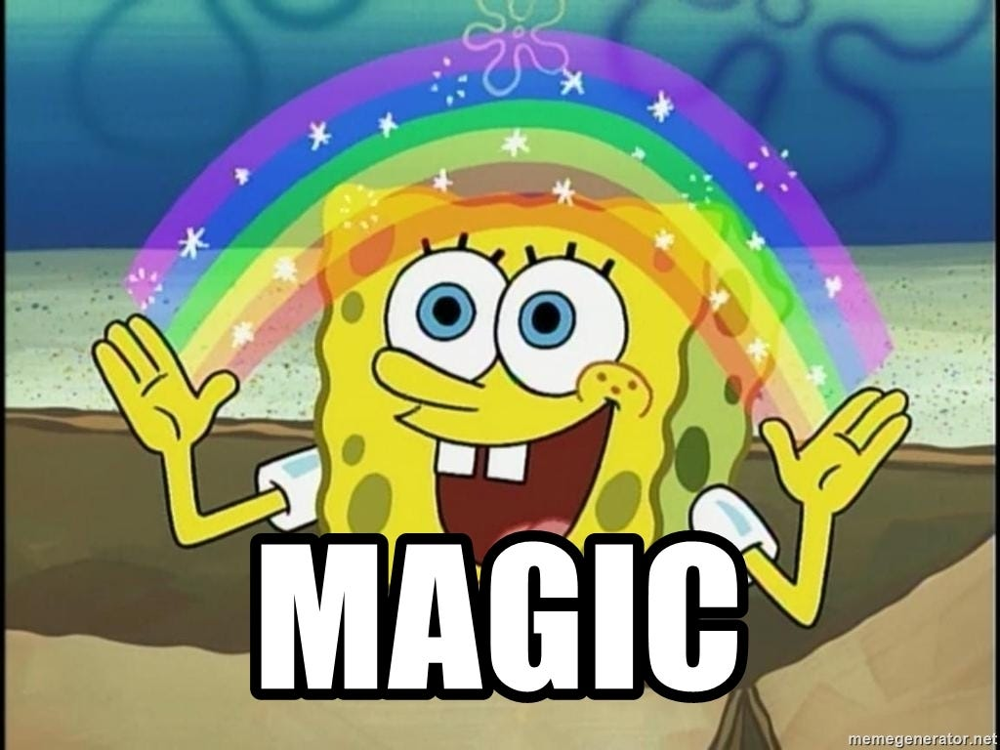

*This post is originally published on [Medium](https://medium.com/@bahleg/godot-html5-and-neural-networks-yet-another-way-to-reinvent-the-wheel-45461d56d0b5)*

<center>

</center>

Godot is an awesome and a very rapidly growing game engine allowing thousands of developers to implement their ideas to life — ranging from simple pet-projects to quite mature commercial games.
However, like any emerging technology, Godot still has areas that need improvement. One such area is the integration of deep learning and neural networks.

The use of deep learning in Godot is a topic of lively debate. Some developers advocate for including neural network capabilities directly within the engine, while others argue that such functionality should remain in the domain of third-party tools, as it’s not central to Godot’s core purpose. Another point of contention lies in how neural networks would be used: for many projects, neural networks are only needed during inference (e.g., for tasks like real-time image upscaling). But for certain projects, the ability to train networks within the game itself is crucial.
In my case, I needed a neural network capable of being trained during gameplay. Since my dataset is relatively small, I don’t have strict requirements for GPUs or other computational resources. However, my network architecture is complex and demands flexibility in both design and training. Additionally, I’m particularly excited about Godot’s HTML5 export capabilities, which allows users play your game in browsers, so browser compatibility was also an essential factor in my approach.

**Disclaimer:** The approach described here may not be optimal for all use cases. It is just one way to work with neural networks in Godot, and I’ll discuss its limitations at the end of the article.

<center>
<figure>
    
    <figcaption>Actually, this meme made with my awesome photoshop skills fully explains what I propose here :)</figcaption>
</figure>
</center>


Well well well, what do we have here?
=====================================

Before diving into my solution, let me briefly outline some alternatives I explored:
1. **Godot Libraries and Assets for Neural Networks**: A good starting point for neural network integration in Godot is using libraries like [NNET](https://github.com/ZeroLikviz/godot_plugin-neural-network). These tools provide a quick way to bring neural networks into your project. However, the main drawback is their dependency on the library’s development lifecycle, which might slow down or stop entirely. Since Godot is still a relatively young engine, the ecosystem of mature libraries is much smaller compared to more established engines like Unity.

2. **Neural Network Libraries for C#**
Libraries like [Microsoft ML.Net](https://dotnet.microsoft.com/en-us/apps/ai/ml-dotnet) could theoretically allow for neural network integration in Godot. However, I couldn’t find any successful examples of this approach being used in practice. Moreover, although Godot can be used together with C#, it isn’t currently supported for HTML5 export, which made this option a non-starter for my needs.

3. **Building a Neural Network Library from Scratch**
Writing your own neural network library tailored to your needs is always an option, especially if performance isn’t a major concern. However, this approach comes with significant drawbacks. To make a library truly flexible, you would need to write a considerable amount of code. Alternatively, if you go for simplicity, you risk being constrained by limited functionality. Implementing key features like backpropagation, layer logic, and optimization techniques (e.g., Adam) could take as much time as developing the entire game prototype itself.

Apart from these alternatives, I would also add libraries like [Godot AI Gym](https://lupoglaz.github.io/GodotAIGym/) and [godot-rl agents](https://huggingface.co/learn/deep-rl-course/en/unitbonus3/godotrl). They bring powerful reinforcement learning tools to Godot. While these libraries officially don’t support Godot’s Web export, they use a client-server architecture similar to my approach. For readers interested in reinforcement learning specifically, these libraries could be useful alternatives. However, they are primarily focused on RL tasks and are not well-suited for broader neural network needs.

As you can see, the available alternatives are quite limited, each with its own set of trade-offs. In the next section, I’ll describe the approach I ultimately chose, which aims to strike a balance between flexibility, functionality, and ease of implementation.

What I wanted
=============

To summarize my ideal vision of a tool for using neural networks in Godot, here’s what I consider essential:

1.  **Flexibility:** The tool should support a variety of models, ranging from simple linear regressions and one-layer MLPs to more complex architectures like convolutional and recurrent models. Naturally, it should also include modern tools like optimization algorithms (e.g., Adam/AdamW), gradient clipping, regularization techniques, and more.
2.  **HTML5 Compatibility:** Since I’m leveraging Godot’s HTML5 export, the tool must work seamlessly in a browser environment.
3.  **Similarity to PyTorch (Optional):** While not a strict requirement, compatibility with or similarity to PyTorch would be ideal. PyTorch is a widely used library in the deep learning community, and being able to transfer code with minimal adjustments would save a lot of time and effort.

That’s all. Not too much to ask, right? Yet, as it turns out, none of the existing alternatives quite fit the bill: **Godot libraries** are not flexible enough, **libraries written in C#** are not compatitible with HTML5. **Writing my own library** is possible but far from trivial. Implementing a basic set of functionalities isn’t hard, but every additional modification would require significant effort, especially for advanced features.

As you can see, none of these options tick all the boxes, leaving me with the need to explore another path.

What I propose
==============

To achieve a flexible neural network framework similar to PyTorch, the most straightforward idea is to try running PyTorch alongside Godot. While embedding PyTorch directly into Godot may be impossible, many use cases can be addressed by running two separate applications: Godot as the client and a Python script with PyTorch support as the server.

<center>

</center>

In theory, this sounds simple, but there are key challenges to consider:

1.  **We are targeting at HTML:** in a desktop environment, running a Python interpreter as a separate script and communicating with it via HTTP requests (or another protocol) is straightforward. However, when targeting HTML5, running Python isn’t feasible. Browsers don’t support executing Python code directly, making communication between the main Godot application and a Python interpreter non-trivial.
2.  **PyTorch in HTML:** Even if we somehow manage to run Python in a browser, the chances of successfully running PyTorch are low. PyTorch is a highly sophisticated library that relies on OS-specific features and hardware-optimized libraries for mathematical computations. Porting such functionality to a browser environment is currently infeasible.

Python and HTML: bridging the gap
---------------------------------

To address the challenge of running Python within an HTML5 environment, we can use **Pyodide** — a framework that enables executing Python code directly inside web containers. Pyodide leverages WebAssembly to provide Python functionality in the browser. The basic run of Pyodide is straightforward, as shown in the example below [(from the library tutorial)](https://pyodide.org/en/stable/usage/quickstart.html).

```html
<!doctype html>
<html>
  <head>
      <script src="https://cdn.jsdelivr.net/pyodide/v0.26.4/full/pyodide.js"></script>
  </head>
  <body>
    Pyodide test page <br>
    Open your browser console to see Pyodide output
    <script type="text/javascript">
      async function main(){
        let pyodide = await loadPyodide();
        console.log(pyodide.runPython(`
            import sys
            sys.version
        `));
        pyodide.runPython("print(1 + 2)");
      }
      main();
    </script>
  </body>
</html>
```

As you can see, Pyodide allows running Python code in the browser by embedding the interpreter in JavaScript. The great advantage is that both Pyodide and Godot can be run simultaneously and communitcate with each other on a single HTML page.
Imagine, we have a python code snippet:

```python
def echo(s):
 print (s) 
 return 42 # just returning value for the example
```

We can run it inside Godot using the following way. At first we must create a function to initialize Pyodide and expose a way to execute Python commands:

```javascript
<script type="text/javascript">
      async function main(){
        let pyodide = await loadPyodide();
        return pyodide;
      }
      let pyodideReadyPromise = main();
      let pyodideInstance;
      pyodideReadyPromise.then((pyodide) => {
        pyodideInstance = pyodide;
    });
      function run_py(cmd) {
            return pyodideInstance.runPython(cmd); // running Python-code
            }
    </script>
```

In Godot, we can use the **JavaScriptBridge** to call the JavaScript function **run_py** and execute Python code:

```godot
var text_to_print = 'Hello world'
var cmd = "run_py(`echo('%s')`);" % text_to_print
var js_return = JavaScriptBridge.eval(cmd) # here we will get 42
```

This approach establishes a communication bridge between Godot and Pyodide, enabling Python execution directly within the browser.

PyTorch in Pyodide
------------------

While Pyodide allows us to run Python inside an HTML environment and bridges the gap between Python code and Godot, it doesn’t fully solve our second problem: **running PyTorch in Pyodide**. Pyodide supports building Python libraries with dependencies and provides pre-built libraries such as NumPy. However, attempting to run PyTorch in Pyodide is highly challenging due to PyTorch’s heavy reliance on native OS-level libraries for optimized computation. Building PyTorch to run in Pyodide has been discussed extensively, as illustrated in [this GitHub issue](https://github.com/Pyodide/Pyodide/issues/1625).

One way to simplify the problem is to use a lightweight library like [tinygrad](https://github.com/tinygrad/tinygrad). tinygrad is a minimalistic library inspired by PyTorch, designed to provide the following essential features:

1.  **Common Layers** and **basic tensor operations**: Linear, convolutional, batch normalization, and more.
2.  **Optimizers**: Popular optimizers like Adam, SGD, and others.
3.  **Utilities for Modern Deep Learning:** Nonlinearities (ReLU, sigmoid, etc.), parameter initializers, and loss functions.
4.  **Different backends for deep learning computation**: actually, this is the most interesting part of this library, but quite useless for our goal, since we are aiming at HTML export, the usage of different backends for different hardware can be cumbersome.

To illustrate, let’s compare three implementations of a simple task: training a 1-layer ReLU network using the Adam optimizer.

This is how it can be written in PyTorch:

```python
import torch
import torch.nn as nn
import torch.optim as optim
# generating XOR dataset for example
X = torch.randint(low = 0, high = 2, size=(200, 2)) 
Y = torch.logical_xor(X[:, 0], X[:, 1]).view(200, -1).float()
X = X + torch.randn(200, 2) * 1e-2 # adding some noise
epoch_num = 1000
model = nn.Sequential(nn.Linear(2, 2), nn.Sigmoid(), nn.Linear(2, 1))
optimizer = optim.SGD(model.parameters(), lr=1.0)
criterion = nn.BCEWithLogitsLoss()
for _ in tqdm(range(epoch_num)):
    optimizer.zero_grad()
    # taking first 100 elements as train and other 100 elements as test
    output = model(X[:100]) 
    loss = criterion(output, Y[:100])
    loss.backward()
    optimizer.step()
print ('accuracy ', torch.eq(model(X[100:])>0.0, Y[100:]).float().mean() )
```

And this is how it’s written in tinygrad:

```python
from tqdm import tqdm
import numpy as np
from tinygrad import Tensor, nn
# generating XOR dataset for example
X = np.random.randint(low = 0, high = 2, size=(200, 2)) 
Y = np.logical_xor(X[:, 0], X[:, 1]).reshape(200, -1).astype(np.float32)
X = X + np.random.randn(200, 2) * 1e-2 # adding some noise
X = Tensor(X)
Y = Tensor(Y)
# tinygrad doesn't have class similar to pytorch nn.Module,
# so we mimic it here
class MyNetwork:
    def __init__(self):
        self.l1 = nn.Linear(2, 2)
        self.l2 = nn.Linear(2, 1)
        
        
    def __call__(self, x:Tensor) -> Tensor:
        return self.l2(self.l1(x).sigmoid())
        
        
epoch_num = 1000
model = MyNetwork()
# listing explicitly the model parameters to train
optimizer = nn.optim.SGD([model.l1.weight, model.l1.bias, 
  model.l2.weight, model.l2.bias], lr=1.0)
criterion = Tensor.binary_crossentropy_logits
with Tensor.train():
    for _ in tqdm(range(epoch_num)):
        optimizer.zero_grad()
        # taking first 100 elements as train and other 100 elements as test
        output = model(X[:100]) 
        loss = criterion(output, Y[:100])
        loss.backward()
        optimizer.step()
        
print ('accuracy ', 
      Tensor.eq(model(X[100:])>0.0, Y[100:]).float().mean().numpy() )
```

While tinygrad doesn’t aim to replicate PyTorch entirely, it’s powerful enough for many use cases. For developers looking to train simple models or run deep learning experiments in constrained environments, it can be a seamless replacement. If you need even more simplicity, the authors of tinygrad have created [**teenytrad**](https://github.com/tinygrad/teenyygrad) — a stripped-down version of tinygrad that implements its core ideas. It’s designed to be lightweight while still functional enough for basic tasks.

```python
import math
from tqdm import tqdm
import numpy as np
from teenygrad import Tensor, nn
from teenygrad.nn.optim import SGD
# teenygrad doesn't contain Linear class, 
# so we just copy it from tinygrad
class Linear:
    def __init__(self, in_features:int, out_features:int, bias=True):
        bound = 1 / math.sqrt(in_features)
        self.weight = Tensor.uniform(out_features, 
              in_features, low=-bound, high=bound)
        self.bias = Tensor.uniform(out_features,
             low=-bound, high=bound) if bias else None
    def __call__(self, x:Tensor) -> Tensor: 
        return x.linear(self.weight.transpose(), self.bias)
# generating XOR dataset for example
X = np.random.randint(low = 0, high = 2, size=(200, 2)) 
Y = np.logical_xor(X[:, 0], X[:, 1]).reshape(200, -1).astype(np.float32)
X = X + np.random.randn(200, 2) * 1e-2 # adding some noise
X = Tensor(X.tolist())
Y = Tensor(Y.tolist())
# teenygrad doesn't have class similar to pytorch nn.Module,
# so we mimic it here
class MyNetwork:
    def __init__(self):
        self.l1 = Linear(2, 2)
        self.l2 = Linear(2, 1)
        
    def __call__(self, x:Tensor) -> Tensor:
        return self.l2(self.l1(x).sigmoid())
        
        
epoch_num = 1000
model = MyNetwork()
# listing explicitly the model parameters to train
optimizer = SGD([model.l1.weight, model.l1.bias, 
  model.l2.weight, model.l2.bias], lr=1.0)
criterion = Tensor.binary_crossentropy_logits
with Tensor.train():
    for _ in tqdm(range(epoch_num)):
        optimizer.zero_grad()
        # taking first 100 elements as train and other 100 elements as test
        output = model(X[:100])
        loss = criterion(output, Y[:100])
        
        loss.backward()
        optimizer.step()
        
print ('accuracy ', np.equal(model(X[100:]).numpy()>0.0,
       Y[100:].numpy()).mean() )
```

As demonstrated, teenygrad offers only basic deep learning functionality, but many additional features can be adapted from tinygrad. An interesting point is that all backend support has been removed from teenygrad and replaced with a simple, naive backend. Surprisingly, for my use case, this naive backend performs faster than tinygrad’s default backend. While it is approximately five times slower than PyTorch, this performance gap is negligible for small neural networks.

Putting all together
--------------------

So, to sum up what we aim to achieve:

1.  Run an HTML webpage with Pyodide interpreter and Godot in one page.
2.  Import teenygrad to to handle basic neural network operations and execute neural network logic.
3.  Develop a set of simple functions to facilitate interaction between Godot’s JavaScript and Pyodide’s Python environment.

<center>

</center>

The first step is quite simple: Godot allows to run HTML export with your HTML template, so you can inject Pyodide inside the HTML.

<center>

</center>

The second step is a bit trickier: Pyodide doesn’t allow direct imports from external files due to the limitations of HTML5 technologies and associated security restrictions. The simplest solution is to leverage Pyodide’s ability to create a local filesystem within the WASM container at runtime. By writing the entire Python server code (including teenygrad) directly into this local filesystem, we can bypass the need for external file imports.
Here’s how it works in a basic setup:

1.  Create an HTML template:

```html
<!doctype html>
<html>
  <head>
      <script src="https://cdn.jsdelivr.net/Pyodide/v0.26.3/full/Pyodide.js"></script>
        <meta charset="UTF-8">
  </head>
  <body>
      <script type="text/javascript">
      async function main(){
        let Pyodide = await loadPyodide();
        # we need numpy build-in in the Pyodide
        await Pyodide.loadPackage("numpy"); 
        Pyodide.runPython(`from pathlib import Path`);
        
        CODE # this text will be replaced by our python source code copying
        
        # this is our main entrypoint function
        Pyodide.runPython("from server import run"); 
        
        return Pyodide;
      }
      let PyodideReadyPromise = main();
      let PyodideInstance;
      PyodideReadyPromise.then((Pyodide) => {
        PyodideInstance = Pyodide;
    });
      function run_py(cmd) {
            console.log('run: '+cmd)
            return PyodideInstance.runPython(cmd); 
            }
    </script>
    
  <canvas id="canvas"></canvas>
    <script src="$GODOT_URL"></script>
    <script>
        var engine = new Engine($GODOT_CONFIG);
        engine.startGame();
    </script>
  </body>
</html>
```

2. Create a python script that transforms the HTML template into real HTML:

```python
from pathlib import Path
buffer = []
for f in Path('./').glob('**/*py'):
        with open(f) as inp:
            # usually can be met in comments
            text = inp.read().replace('`', ' ') 
        buffer.append(f"""
Path("/home/Pyodide/{f.parent}").mkdir(parents=True, exist_ok=True)
Path("/home/Pyodide/{f}").write_text(\"\"\"{text}\"\"\")""")
with open('test.html') as inp:
        data = inp.read()
        
with open('test_out.html', 'w') as out:
        out.write(data.replace('CODE', 
"Pyodide.runPython(`"+'\n'.join(buffer)+"\n`)"))
```

The solution is admittedly not very elegant: in the end, all the Python code must be embedded directly into the HTML file, significantly increasing its size. However, this is the trade-off for enabling neural network functionality. That said, there are ways to make this step more efficient, which I’ll discuss later.

Example
=======

To bring everything together, let’s create a proof-of-concept application. We’ll build a Godot application to solve a simple 1D binary classification problem using logistic regression — one of the most popular and straightforward models for this task. The model will be implemented in a teenygrad using our Python server. The Godot application will include two text areas where users can input data points for the two classes. To verify that the model is working, there will also be a field where users can input a test point. Upon submission, the app will display the classifier’s confidence that the point belongs to class “1.”

<center>

</center>

When the user presses the button, the following script will execute:

```godot
var x1 = []
for x in  $Panel/HBoxContainer/TextEdit.text.split('\n'):
  x1.append(float(x))
 
var x2 = []
for x in  $Panel/HBoxContainer/TextEdit2.text.split('\n'):
x2.append(float(x))

var json = JSON.stringify({'x1': x1, 'x2': x2, 'input': float($Panel/HBoxContainer2/LineEdit.text)})
var cmd = "run_py(`run('%s')`);" % json
var js_return = JavaScriptBridge.eval(cmd)
print (['sent ', cmd])
print(['got ', js_return]) # prints '3.0'
$Panel/HBoxContainer2/LineEdit.text = 'Result: %s' % js_return
```

```python
class Model:
  def __init__(self):
    self.w = Tensor.randn(1)
    self.w.requires_grad = True
    self.b = Tensor.zeros(1)
    self.b.requires_grad = True 
  def __call__(self, x:Tensor):
    return x@self.w + self.b
    
def run(post_data):
        try:
            json_data = json.loads(post_data)
            response_message = f"Received JSON data: {json_data}"
            x1 = json_data['x1']
            x2 = json_data['x2']
            
            # list concatenation
            x = Tensor(x1+x2).reshape([-1, 1])
            # making labels
            y = Tensor([0]*len(x1) + [1] * len(x2))
            model = Model()
            
            # setting SGD with quite aggressive learning rate
            opt = optim.SGD([model.w, model.b], lr=1.0)
            criterion = Tensor.binary_crossentropy_logits
            # running optimization for 1000 epochs
            for _ in range(1000):
                opt.zero_grad()
                loss = criterion(model(x), y)
                loss.backward()
                opt.step()
            
            input_ = json_data['input']
            response_message =  str(model(Tensor([input_])).sigmoid().numpy())
            
        except Exception as e:
             response_message = repr(e)
        return response_message
```

After the button is pressed, the results will appear in the same input field.

<center>



</center>


For simplicity, we’ve omitted error handling. Additionally, the request to Pyodide is made from the main thread, causing the application to freeze until the Python server responds. On a typical laptop, this takes about 1–2 seconds, but on a mobile device, it may take significantly longer (up to 10 seconds in some cases).
This demo is available [here](https://bahleg.itch.io/nn-godot) , and [here](https://github.com/bahleg/godot_nn_demo/) you can find the code.

Pros and Cons and final thoughts
================================

The method I’ve described has one major advantage: **simplicity**. It’s well-suited for prototyping or pet projects where you don’t need to worry about hiding or securing your code. However, for more complex or production-grade projects, there are notable limitations:

1.  **Security**: Embedding the entire codebase directly into an HTML page is far from ideal. Not only does it expose your intellectual property, but it also poses significant security concerns. To protect your code we can use some kinds of obfuscators like [pyobfuscate](https://github.com/astrand/pyobfuscate), but of course they are not foolproof. Also, Pyodide provides multiple ways to load your code, for example you can upload it on the web server and install it via python wheel. Nevertheless, this method seems to be overcomplicated if you are not targetting for the fully-fledged game project.
2.  **Performance**: Running neural networks directly inside a web browser comes with an unavoidable performance hit. This is an inherent limitation of the method, as the web environment is not optimized for computationally intensive tasks like deep learning. Compared to native PyTorch running on local hardware, the performance will be noticeably slower.
3.  **Compatibility**:While tinygrad and teenygrad share many similarities with PyTorch, they are not direct replacements. This means you won’t be able to seamlessly use libraries from the PyTorch ecosystem. On the other hand, the tinygrad repository [claims](https://github.com/tinygrad/tinygrad/blob/master/docs/showcase.md) that it’s possible to run stable diffusion and LLaMA models on it, which is very impressive and gives us a hope that this is also somehow can be possible in the settings I’ve described.

Even with theses drawbacks, this approach worth to test and can be useful in many use-cases from protyping to the pet-projects.
Thank you for the reading! I hope my journey into integrating neural networks with Godot has been both informative and useful!
