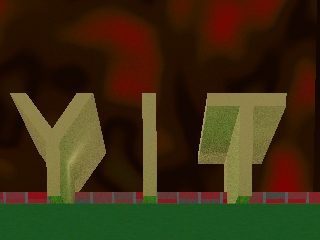
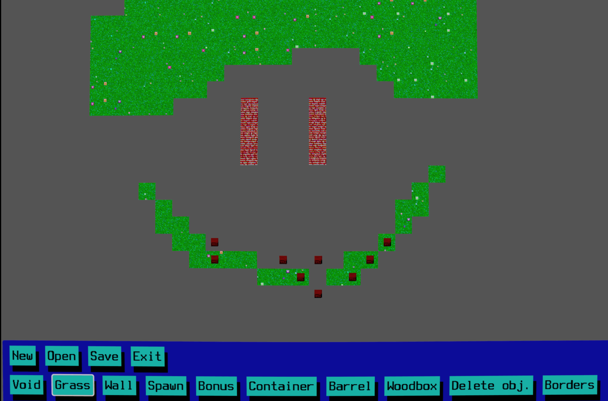
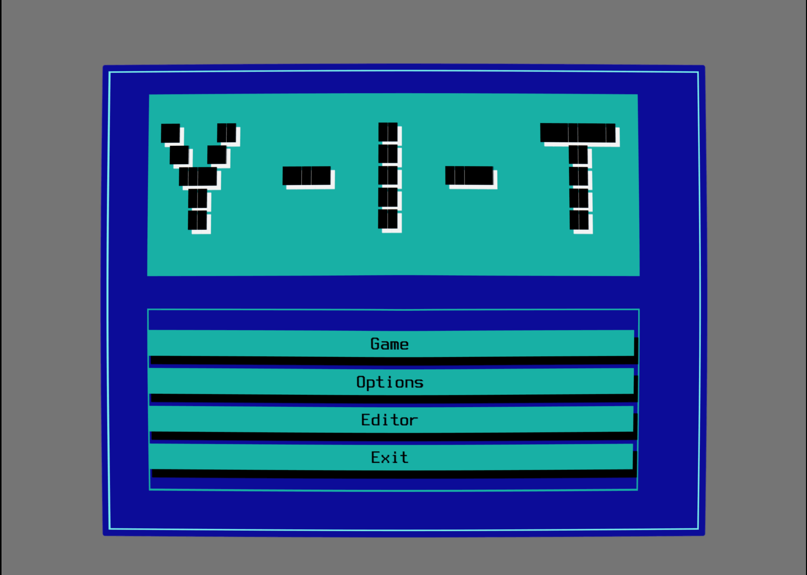
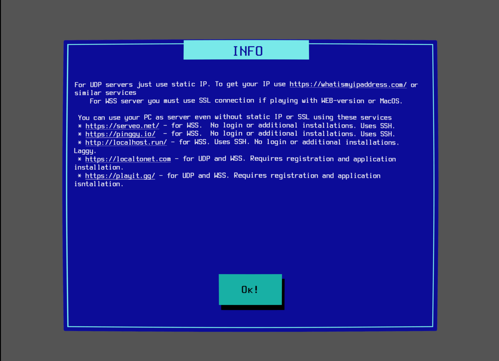
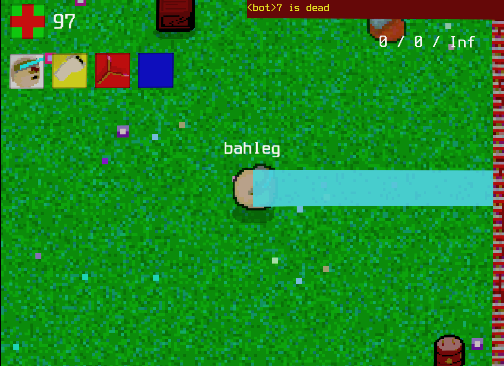
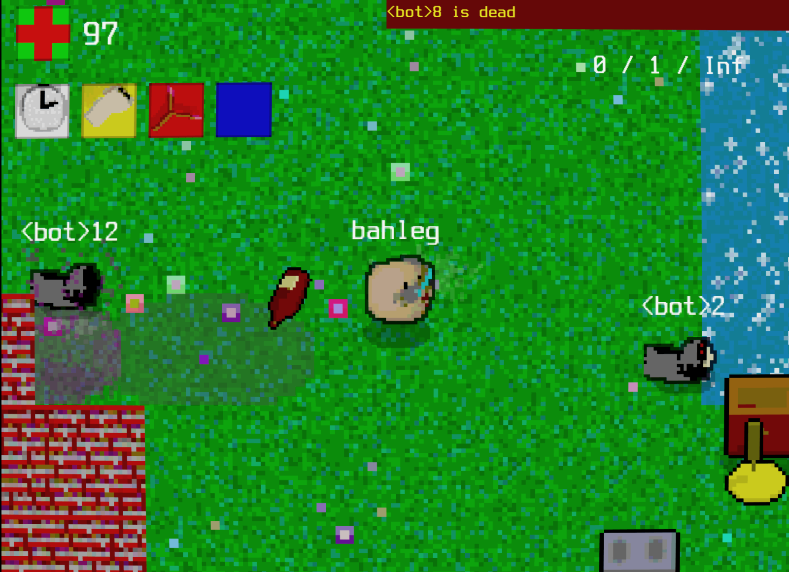

*This post is originally published on [itch.io](https://bahleg.itch.io/y-i-t/devlog/1389509/devlog-0-hello-world-or-the-first-devlog-about-y-i-t) about my game called [Y-I-T](https://bahleg.itch.io/y-i-t)*

This post begins a series (I hope!) of devlog entries about my hobby project, Y-I-T. Y-I-T is a chaotic multiplayer shooter inspired by the cursed 200-games-in-one CDs of early 2000s Russia.

This first entry will be different from the ones that follow: I'm planning to develop my game further, so this devlog is starting point. Rather than a traditional devlog, it will serve more as a post-mortem, documenting the game’s current state.

# What is it about?

**Y-I-T** (pronounced **“Yyyyit”**) is a multiplayer nostalgic game. I’m developing it in my free time — which isn’t much. At the moment, I spend about an hour a week on it, though sometimes I dive in and change something small.

Although the game looks bad, sounds bad, and even plays a bit rough, it’s a very personal project for me. I was born in Russia, and during my school years we had tons of pirated CDs with huge collections of computer games of wildly different quality. One of my first CDs claimed to contain 200 games. They had almost nothing in common: alongside good and diverse titles like the shareware versions of **Quake** and *Doom*, or games like **Gobliins** and **Kyrandia**, there were also poorly made card games with terrible graphics, games that didn’t run at all, or games that barely had any UI or visuals.

All of this influenced me a lot. I wanted to create something that would feel like it belonged on one of those CDs: strange pixel graphics, creepy sound effects, and an outdated UI. When I was playing games from that collection, none of those flaws reduced my enjoyment.

I can’t say I’ve fully succeeded yet. The game definitely looks strange, but it’s still not very engaging from a gameplay perspective. It’s still in development, though, and I hope that one day it will become interesting for some nostalgic geek like me :)

Below, I’ll go into more detail about how I see the project.

# Game style

Y-I-T is a top-down shooter with primitive graphics. The main feature of the game — or at least what I hope it will become — is a large number of bonuses, along with dumb and strange weapons and artifacts.

The core mode is a deathmatch. You choose one of the heroes (currently there are four), each with a specific skill. The map is generated randomly, though you can also create your own using a simple map editor.

<figcaption>Game edtior</figcaption>

Ideally, the game should feel like a bullet hell, where something is happening on the map every second.

# Graphics

*I guess it would be nice to attach some screenshots of the games I'm referencing, but not sure if I'm allowed to do this because of copyright reasons. Anyway, most of them can be found by Google :)*

I don’t have a clear visual reference for the graphics, but the game should look like a very retro project made by not-so-talented artists :)  As references, I would mention games like **Fatman** (a very weird fighting game), **Battle for the Sea** (an old naval war game), and strange titles like **KOZEL** (a DOS version of a Russian card game).

And of course, **Battle City**, which was very popular among Russian kids. I didn’t have it myself, but I think some of the vibes of that top-down arcade game definitely influenced me. I would also mention the game called **Manager**. It's a very primitive text-like manager with the UI inspired by Norton Commanded interface. Although the game is super simple and doesn't worth to play it, I liked the idea to use this retro DOS/Norton UI in the games.

<figcaption>Main menu is inspired by old DOS utils</figcaption>

# Controls

Although it’s not a direct reference, in many aspects I looked at **The Binding of Isaac**. I liked the idea of a top-down shooter controlled entirely with the keyboard.

In short, all you can do is move, shoot, or attack in melee — so there is both a melee and an automatic weapon. You can also use your artifact (some are passive, some are activatable) and your perk. That’s it.

While this control system makes movement and aiming a bit uncomfortable, it also makes it easier to port the game to mobile devices in the future.

# Network

The idea for this game appeared when I was bored and wanted to play something with my friends who live in different cities and countries. In the ideal case, I’d like to have a very simple, one-button multiplayer that works across all platforms.

<figcaption>The network part is quite challenging now: you can run multiplayer in different ways, but there is no one-button ways :( This is to be implemented</figcaption>

# Current Game Status

At the moment, I have a very rough version of the idea implemented in Godot. It’s already playable, with four characters and about 64 in-game items. However, many things still need to be improved.

First, and most importantly, I don’t like how it currently feels in terms of dynamics. Although it’s fun to play for 15–30 minutes with friends, the pacing is still too slow. It feels like you’re controlling a weird tank rather than a character.

<figcaption>The screenshot from the game, one of the characters, called Sviboborg, uses laser from his eyes</figcaption>

<figcaption>Another screenshot: here the bot throws a bottle at player, making him drunk (!)</figcaption>

Second, content. If my goal is to make the game truly diverse, the amount of content probably needs to be multiplied by ten :) I’m working on that. It’s not only about adding characters and assets, but also about introducing different game modes.

Third, visualization. This is probably the most problematic aspect.  On the other hand, it’s kind of a guilty pleasure — I actually love how it looks :) In a perfect world, where I could spend unlimited time on this project, I’m still not sure whether I would remake all the sprites or keep them as they are.

Finally, the technical side. When I started this project, I was just experimenting with Godot. Like a typical coder, I ignored the “RTFM” rule and made a lot of mistakes in how I structured the game and wrote the code. So a significant refactoring is needed. I’m also very interested in multiplayer and how it can be implemented in a simple and robust way.

These are the aspects I plan to focus on next. **Stay tuned :)**
