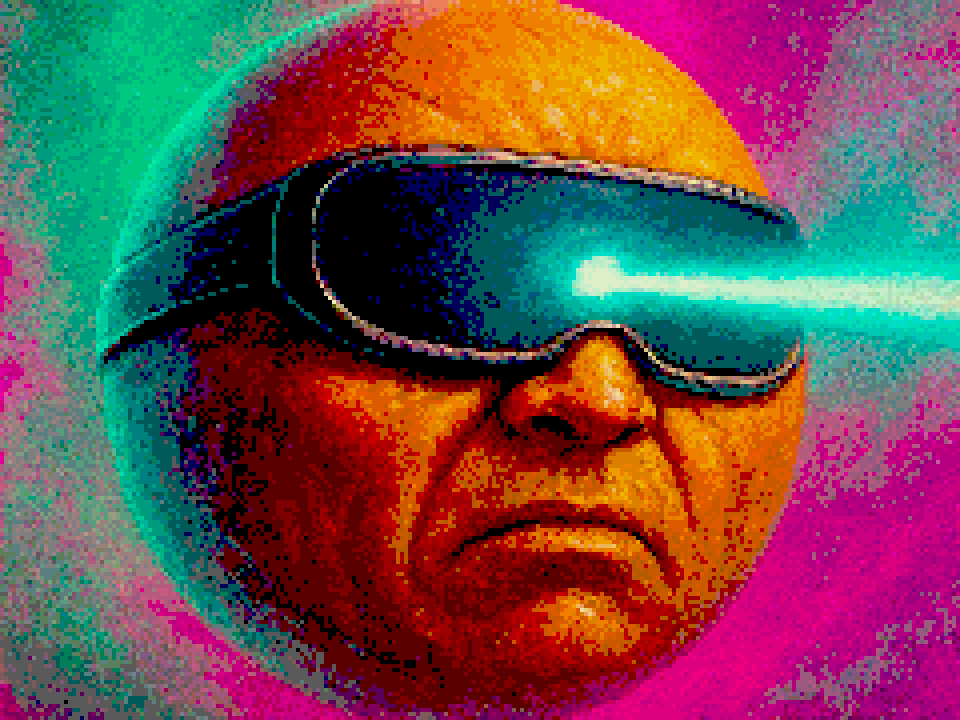
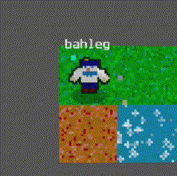
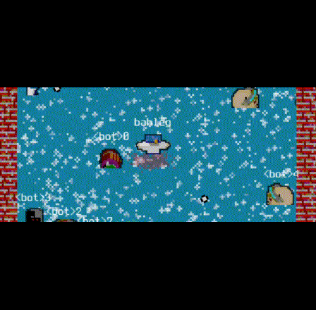
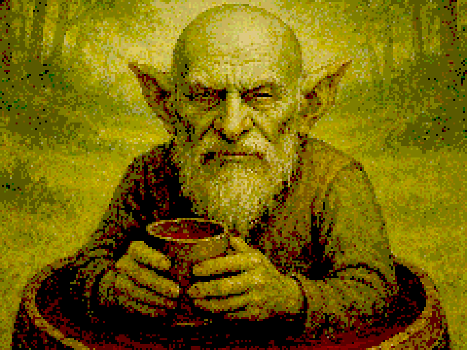
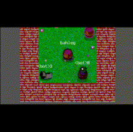
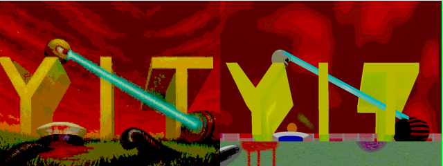

*This post is originally published on [itch.io](https://bahleg.itch.io/y-i-t/devlog/1468482/devlog-1-2025-brief-report) about my game called [Y-I-T](https://bahleg.itch.io/y-i-t)*

As mentioned in the [first devlog](https://bahleg.itch.io/y-i-t/devlog/1389509/devlog-0-hello-world-or-the-first-devlog-about-y-i-t), my game Y-I-T has been in development since 2023. In that post, I described the overall state of the game during 2023–2024. Last year, I decided to dedicate some time to the game and started introducing new features.

This devlog briefly describes what was done in 2025 (actually starting from August 2025). Future devlogs will be shorter and will focus on new updates. 

# Liquids

One feature I wanted to implement to make the gameplay more diverse is liquid tiles. Currently, there are four types: water, toxic water (which slowly reduces health), acid (which kills the player instantly), and lava.

Technically, all tiles are animated at a reasonable update rate. In terms of gameplay, most of the mechanics related to these liquids are inspired by Quake 1, where I first encountered this kind of design. The liquids are not just decorative — there is interaction between player effects, weapons, objects, and the tiles. For example, a character on fire can extinguish it by entering water. Or (my favorite feature, hello Q1!), if you use the lightning gun in water, both you and nearby enemies will die.

This part is still a work in progress. Bots are not very confident when navigating through liquids yet, and I also want to make these tiles more engaging.

# Diogen

One of the characters in my game is a troll named Diogen, who sits in a barrel and restores health. 

During playtesting with my friends, I realized that this character was quite boring, since we tended to keep him far from the battlefield.

Now I've changed his perk to make the gameplay more dynamic: when the perk is active, Diogen starts to lose health. After deactivating it, he gains a damage bonus proportional to the time the perk was used. So, on one hand, he loses health (which prevents the player from using the perk for too long), and on the other hand, once he builds up enough bonus, he can potentially kill everyone on the map.

# UI updates

One of the most pleasant results I obtained during my coding sessions in 2025 was, surprisingly, related to AI generation tools. I experimented with GPT models and asked them to generate images for each of my four playable characters. Surprisingly, the results were very good.

I then tried some other AI models, but the OpenAI version was the best. I added some noise and rescaled the images to make them look more like retro loading screens. And as you can see, the results are pretty good!

<figcaption>New vs old loading screen</figcaption>

# Making better weapon sounds

Regarding sound, after a few play sessions I realized that the monotonous weapon sounds were a bit annoying, so I decided to add some random modulation when the player shoots. This added a very simple dynamic behavior to the sound. The idea is not mine, and I guess I found it [here](https://www.youtube.com/@Challacade/videos), but for the references you can find in many places, for example [here](https://www.youtube.com/shorts/ZYZRr05AMNE).

# Starting making music

It's practically impossible to find a good game without music (change my mind!). At this point I realized that Y-I-T, as a good game, must also contain music :)

When looking at retro-style music tools, I settled on Famistudio, which is a great Famitracker-like tool for composing music. The music creation process (technically speaking, not in terms of art) is quite simple and intuitive, which I really liked.

I also decided to set a special limitation for myself: the music must not contain any extra samples. Even drums should be implemented as noise, not as pieces of sound files. Actually, this limitation is a bit of overkill: even in the games I used as references, the music was often implemented as MIDI files, but I decided to experiment with stricter constraints :)

Currently, my plan is the following: since each playable character has their own features, each character should also have their own musical style. For example, the troll Diogen has some folk Greek and Oriental vibes in his music (at least as I imagine it), while the sailor’s music was inspired by industrial metal, and so on. Each character has multiple tracks, and when you start a game for the first time with a given character, the music will be selected from that character’s collection.

As for the music itself, I like some of the tracks I've made, while others will probably need significant reworking in the future.

# Plans and conclusions

To sum up, the progress on the game is not very significant yet, but I’m still moving toward my goal of making a solid, playable deathmatch bullet hell, and I hope that 2026 will be more productive.

The next updates will focus on multiplayer (I want to make it easier to run) and on tuning the game dynamics to make it more challenging and engaging. Stay tuned :) 
